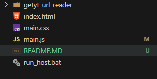
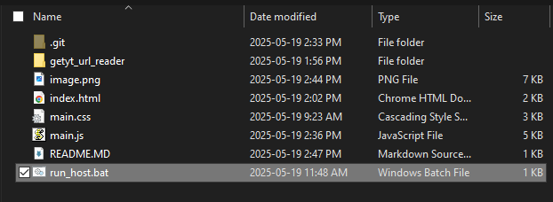
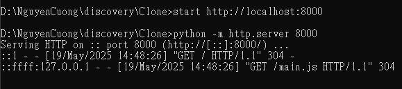
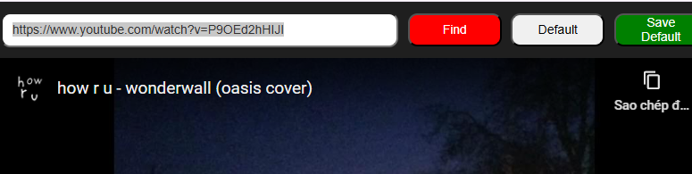
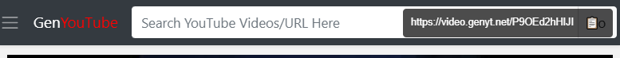
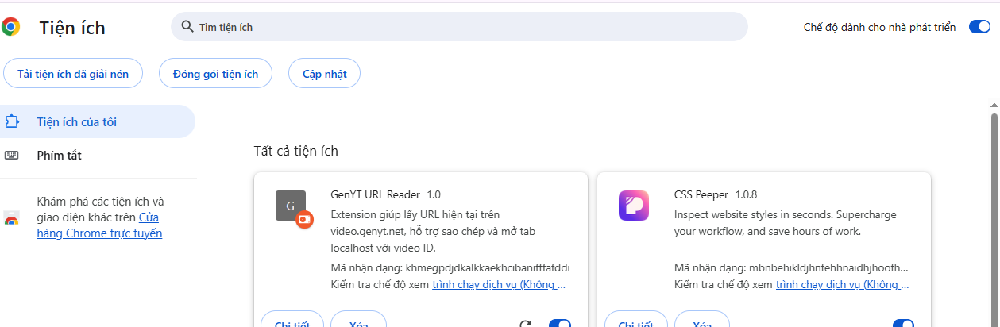
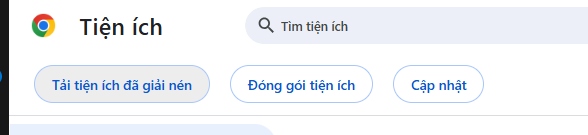
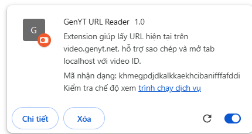
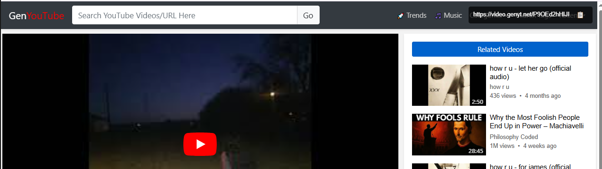
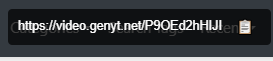

### Chặn Youtube ư ? Đừng lo, hãy dùng cái này =)))

## HƯỚNG DẪN SỬ DỤNG 

### CẤU TRÚC
Sau khi tải về từ `github` folder sẽ có dạng 

- với `getyt_url_reader` là folder `extension Chrome` - sử dụng để lấy id và chuyển hướng từ `GenYouTube` sáng `localhost` 

- `run_host.bat` - file tự động chạy và khởi tạo `localhost` với port 8000 (cần được mở trước)

- còn lại là source `youtube generate` - lấy id và nhúng vào 

### CÁCH SỬ DỤNG 

#### Mở host 8000 (có thể sử dụng, không cần dùng extension)

- double click để mở host 

- như này là thành công 

- quẳng vào một đường link youtube là có thể xem được

#### Sử dụng extension - tiện lợi hơn thì dùng (tự chuyển hướng từ GenYoutube)

##### Thêm extension

- mở quản lý tiện ích và bật chế độ `dành cho nhà phát triển`

- nhấn tiện ích đã được giải nén và thêm folder `getyt_url_reader` vào 

như này là được 

-giờ nó hiện ra đường dẫn như này là ok 

- nhấn vào để chuyển đến host 8000 
--> giải quyết vấn đề phải dán link,....

